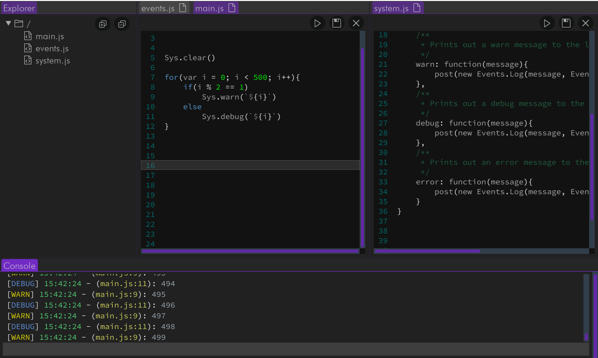

# JSEdit

`JSEdit` is a cutting-edge development environment that integrates JavaScript's versatility with the robustness of Java
and the power of GraalVM. The project combines a virtual file system, an operating system, and a virtual machine to
provide a rich development and runtime experience.

## Features

### Virtual File System

The virtual file system mimics a real-world file system, offering capabilities such as creating, moving, renaming, and
deleting files and folders. The state of the file system is persistently stored on a 'disk' file - a serialized object
that encapsulates everything needed to boot up an environment's workspace. This includes files, folders, and editor
preferences like the last opened file and more. Furthermore, a custom file system allows importing of files within your
virtual file system, enhancing the overall user experience.

### Operating System

The Operating System acts as a bridge between the virtual file system and the virtual machine, enabling seamless
interaction between file storage and execution. It exposes key events like 'clear' and 'log', thereby facilitating
direct communication between JavaScript code and the operating system. The 'clear' event enables the editor console to
be emptied, and the 'log' event provides a powerful logging method.

### Virtual Machine

At the core of `JSEdit`, the Virtual Machine houses a context used for source code evaluation, error handling, and
communication between JavaScript and Java. This tight integration allows for rich interaction and extensibility, pushing
the boundaries of traditional development environments.

## Future Plans

### Language Server Protocol (LSP) Client

We are working on incorporating a fully-fledged LSP client to enable advanced code analysis features such as debugging,
code completion, and usage finding. The LSP client will interact with GraalVM's built-in LSP server, effectively
harnessing the capabilities of this powerful JVM.

### Plugin System

Another exciting enhancement in the pipeline is the introduction of a plugin system. This system will allow JavaScript
code to modify the editor itself, adding an extra layer of customization and functionality enhancements. Users will be
able to change themes, add windows, and perform any other tasks expected from a full-fledged development environment
plugin system, like in VS Code.

The project is continuously evolving, and more exciting features and enhancements are on the way!

## Getting Started

To get started with `JSEdit`, you need to have to do the following:

1. ```git clone https://github.com/MrManiacc/jsedit.git```
2. ```cd jsedit```
3. ```./gradlew run```

It's important to note that if you're running the application on Mac you need to add the VM
argument ```-XstartOnFirstThread``` to the run configuration.

## Contributing

We welcome contributions from the community.

## License

This project is licensed under the MIT License - see the [LICENSE](LICENSE) file for details.

## Contact

For any queries, feel free to reach us at:

- Discord *(best contact)* - `dooZyz#4822`
- Email - `jamess.raynorr@gmail.com`

## Showcase

